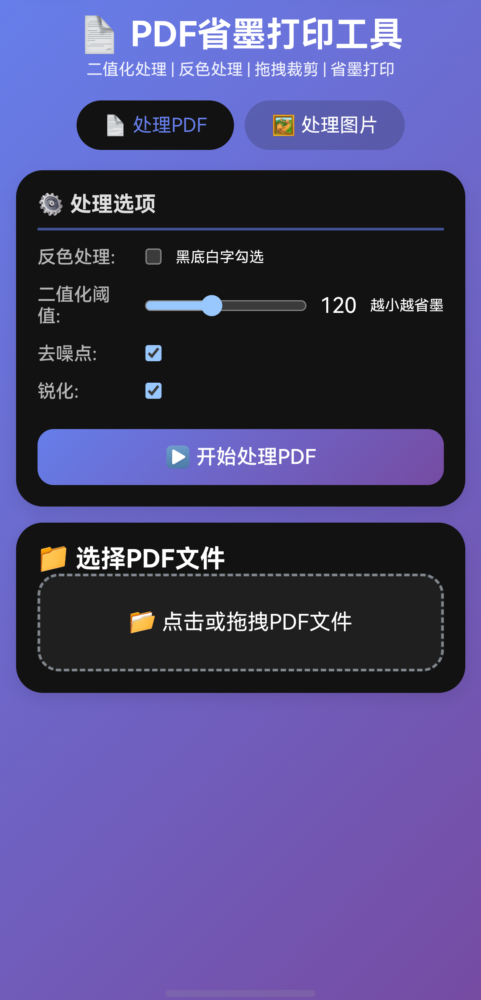
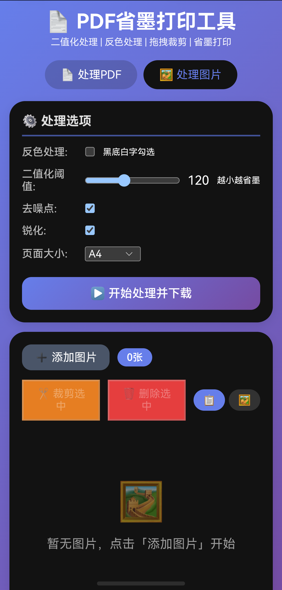

# 📄 PDF省墨打印工具

一个运行在飞牛NAS上的Web版PDF处理工具，支持二值化、反色、拖拽裁剪等功能，帮助打印时大幅节省墨水/碳粉。

[](https://github.com/dwtxaqgb1/pdf-tool/stargazers)
[](https://github.com/dwtxaqgb1/pdf-tool/blob/main/LICENSE)
[](https://hub.docker.com/)

## 📸 界面截图

| 处理PDF页面 | 处理图片页面 |
|------------|------------|
|  |  |

## 🚀 功能特性

### 📄 处理PDF
- 上传PDF文件进行二值化处理
- 支持反色处理（适合黑底白字图片）
- 可调节二值化阈值（80-180，越小越省墨）
- 去噪点、锐化增强
- 实时进度条 + 计时显示

### 🖼️ 处理图片
- 批量添加图片（支持 jpg/png/bmp/gif）
- 列表/缩略图两种视图模式
- **拖拽裁剪**：手指/鼠标拖拽选择裁剪区域，可调整大小
- 合成PDF（支持A4/A3/Letter/自适应）

## ⚙️ 参数说明

| 参数 | 说明 | 推荐值 |
|------|------|--------|
| 反色处理 | 黑底白字时勾选 | 视图片而定 |
| 二值化阈值 | 越小越省墨 | 100-130 |
| 去噪点 | 去除斑点 | 开启 |
| 锐化 | 文字更清晰 | 开启 |
| 页面大小 | 输出PDF尺寸 | A4 |

## 🐳 一键部署

### 方法一：使用加速地址克隆（推荐国内用户）

```bash
# 克隆项目
git clone https://github.dwtxaqgb.eu.org/https://github.com/dwtxaqgb1/pdf-tool.git
cd pdf-tool

# 给脚本执行权限
chmod +x upload.sh

# 一键部署
./upload.sh

⚙️ 技术栈
后端: Python 3.11 + Flask + PyMuPDF + Pillow

前端: HTML5 + CSS3 + JavaScript

容器: Docker

📝 更新日志
v1.0
初始版本发布

支持PDF二值化处理

支持图片合成PDF

支持拖拽裁剪

进度条+计时反馈

📄 许可证
MIT License

🙏 致谢
PyMuPDF - PDF处理库

Pillow - 图像处理库

Flask - Web框架

⭐ 如果觉得有用，请给个 Star 支持一下！
